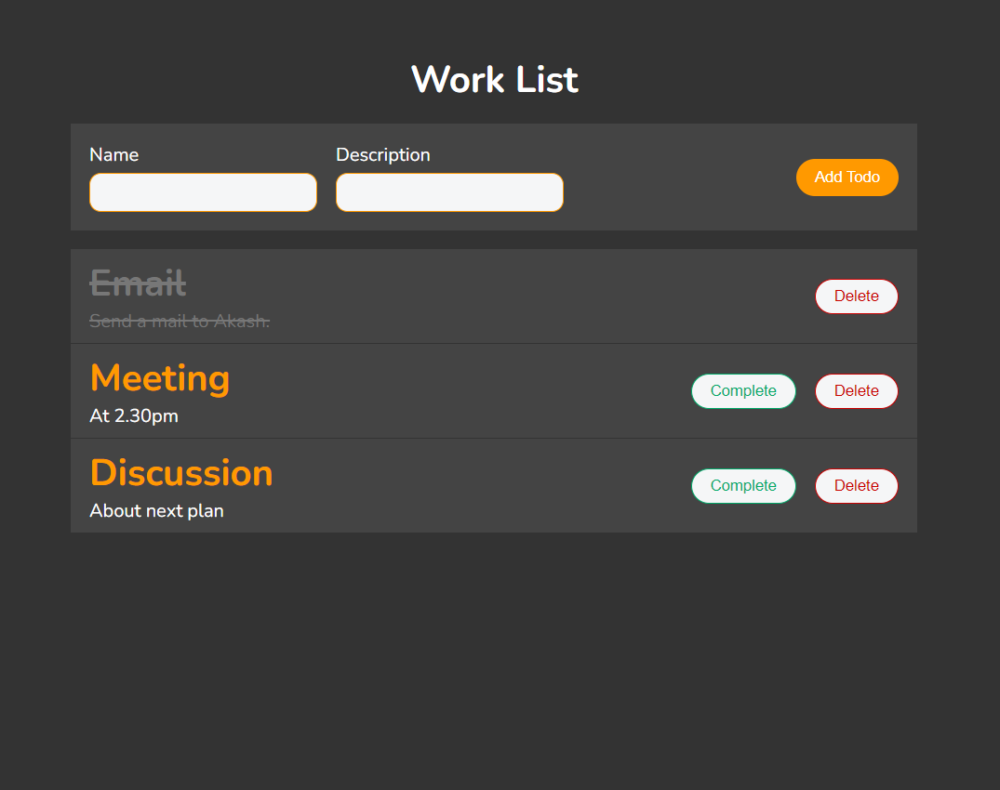

<h1 align="center">Work List using MERN</h1>

## Demo
<p align="center">
  
</p>


## About
This is a simple application built with MERN that allows users to create, save, mark as complete and delete tasks.


## Features
- Create new task with description
- Crossbar over the task that is completed
- React and type script is used for the front-end
- Node is used for the backend
- MongoDB is for database


## Getting started
To get started with the app, you can follow these steps:
``` bash
# Clone this project
$ git clone https://github.com/apurbar06/React_things
# Access
$ cd work-list
# Install the necessary dependencies
$ npm install
# Start the development server
$ npm start
```
The app should now be running on http://localhost:3000.


## License
This app is released under the MIT License.
